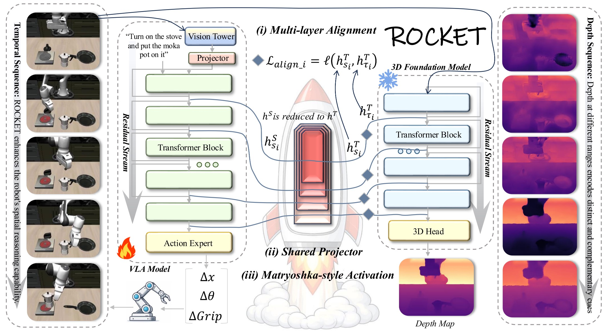

# ROCKET: Residual-Oriented Multi-Layer Alignment for Spatially-Aware Vision-Language-Action Models

[[Paper]](https://arxiv.org/abs/2602.17951) [[Project Page]](https://github.com/CASE-Lab-UMD/ROCKET-VLA)

**ROCKET** is a multi-layer representation alignment framework that injects 3D spatial reasoning from a strong vision foundation model ([VGGT](https://github.com/facebookresearch/vggt)) into 2D-pretrained VLA models. It features:

- **Multi-layer alignment** — leverages spatial cues across multiple depths instead of a single layer
- **Shared projector** — a single projector shared across layers to reduce gradient interference
- **Matryoshka-style sparse activation** — progressively increases projector capacity from shallow to deep layers

ROCKET achieves **98.5% average success rate on LIBERO** with only **~4% of the compute budget** of prior SOTA methods.

<p align="center"></p>

<p align="center"></p>

## Repository Structure

```
ROCKET-VLA/
├── openvla-ROCKET/                    # OpenVLA-7B backbone (simulation: LIBERO, LIBERO-Plus)
│   ├── vla-scripts/                   #   Core Python scripts (training, profiling, deploy)
│   ├── ROCKET-VLA_scripts/            #   Bash scripts for training & analysis
│   │   ├── training_scripts/          #     Training: ROCKET, ablations, baseline
│   │   └── profile_scripts/           #     CKA, gradient, projector similarity, layer importance
│   ├── prismatic/                     #   Model architecture & training utilities
│   └── vggt/                          #   VGGT teacher model
└── openpi-ROCKET/                     # PI0 / PI0.5 backbone (real-world: RoboTwin 2.0, ALOHA)
```

---

## OpenVLA-ROCKET (Simulation)

### 1. Environment Setup

```bash
cd openvla-ROCKET

# Initialize git submodules (LIBERO + transformers-openvla-oft)
git submodule update --init --recursive

conda create -n rocket python=3.10.16 -y
conda activate rocket

pip install torch==2.2.0 torchvision==0.17.0 torchaudio==2.2.0
pip install -e .

# Flash Attention 2 (required for training)
pip install packaging ninja
pip install "flash-attn==2.5.5" --no-build-isolation
```

### 2. Data Preparation

Install the LIBERO benchmark (pulled as a git submodule), then download datasets (~10 GB):

```bash
pip install -e LIBERO
pip install -r experiments/robot/libero/libero_requirements.txt

# Download LIBERO datasets (Spatial, Object, Goal, 10)
git clone git@hf.co:datasets/openvla/modified_libero_rlds ./data/libero
```

Download pretrained models:

```bash
mkdir -p ckpts
# OpenVLA-7B: https://huggingface.co/openvla/openvla-7b
# VGGT-1B:    https://huggingface.co/facebook/VGGT-1B/blob/main/model.pt
```

Expected directory structure:

```
openvla-ROCKET/
├── ckpts/
│   ├── openvla-7b/          # OpenVLA-7B weights
│   └── VGGT-1B/model.pt     # VGGT-1B checkpoint
├── data/
│   └── libero/
│       ├── libero_spatial_no_noops/
│       ├── libero_object_no_noops/
│       ├── libero_goal_no_noops/
│       └── libero_10_no_noops/
```

### 3. Training

**Full ROCKET** (shared projector + Matryoshka, 10 layer pairs):

```bash
bash ROCKET-VLA_scripts/training_scripts/run_align10_rocket.sh
```

We provide pre-configured scripts for each ablation variant:

| Script | Method | Paper Reference |
|--------|--------|-----------------|
| `training_scripts/run_align10_rocket.sh` | **Full ROCKET** (shared + Matryoshka) | Table 8 "+Matryoshka" |
| `training_scripts/run_align10_shared.sh` | Shared projector only | Table 8 "+Shared" |
| `training_scripts/run_align10_naive_multi_layers.sh` | Independent projectors | Table 8 "+Multi-layer" |
| `training_scripts/run_align1_spatial_forcing.sh` | Single-layer alignment | Spatial Forcing reproduction |
| `training_scripts/run_align0_baseline.sh` | Baseline (no alignment) | Table 8 "Baseline" |

All scripts are in `ROCKET-VLA_scripts/` and call the same underlying `vla-scripts/finetune_rocket.py` with different configurations.

Key differences between scripts (all other parameters are shared):

| Script | `--align_loss_coeff` | `--share_projector` | `--use_matryoshka` | `--vla/vggt_layers_align` |
|--------|---------------------|--------------------|----|------|
| `run_align10_rocket.sh` | `0.5` | `True` | `True` | 10 pairs |
| `run_align10_shared.sh` | `0.5` | `True` | `False` | 10 pairs |
| `run_align10_naive_multi_layers.sh` | `0.5` | `False` | `False` | 10 pairs |
| `run_align1_spatial_forcing.sh` | `0.5` | `False` | `False` | `"24"` / `"-1"` |
| `run_align0_baseline.sh` | `0` | `False` | `False` | 10 pairs |

> - `--use_matryoshka True`: Matryoshka-style width allocation (shallow layers use fewer params). `--projector_shallow_to_deep_increase` controls the direction.
> - `--use_matryoshka False`: all layers use full hidden_dim. Combined with `--share_projector True`, this is the "shared baseline" (Table 8 "+Shared").
> - `--ensemble_size n`: initializes `n` projectors per layer pair and averages their losses. Default `1` for all paper experiments.

### 4. Analysis & Profiling

All profiling scripts are in `ROCKET-VLA_scripts/profile_scripts/`:

**CKA Similarity Analysis** (Fig. 8, Appendix F):

```bash
# Step 1: Compute pairwise CKA similarity between all VLA (0-32) and VGGT (0-23) layers
bash ROCKET-VLA_scripts/profile_scripts/cka_profiling/run_cka_profiling.sh

# Step 2: Find optimal layer alignment via Hungarian algorithm
python vla-scripts/analyze_profiling_results.py \
  profiling_results/<run_dir>/profiling_results.json \
  --output_dir profiling_results/analysis/
```

**Gradient Conflict Profiling** (Fig. 1, 13, 14):

```bash
# Profile cosine similarity between alignment and task loss gradients
bash ROCKET-VLA_scripts/profile_scripts/grad_conflict/run_gradient_profiling.sh
```

**Projector Similarity Analysis** (Fig. 7, Appendix E):

```bash
# Compare projector output similarity across training for ROCKET / naive / shared
bash ROCKET-VLA_scripts/profile_scripts/projector_similarity/run_align10_rocket.sh
bash ROCKET-VLA_scripts/profile_scripts/projector_similarity/run_align10_naive10.sh
bash ROCKET-VLA_scripts/profile_scripts/projector_similarity/run_align10_share10.sh

# Visualize results (heatmaps + comparison curves)
python ROCKET-VLA_scripts/profile_scripts/projector_similarity/visualize_projector_similarity.py
```

**Layer Importance** (layer selection utilities):

| Script | Description |
|--------|-------------|
| `layer_importance/run_layer_importance.sh` | Measure per-layer cosine similarity scores |
| `layer_importance/rank_layer_importance.py` | Rank layers by importance, select top/bottom-k |
| `layer_importance/compute_layer_selection.py` | Balanced layer selection algorithm (uniform spacing) |
| `layer_importance/parse_similarity_log.py` | Parse profiling logs to CSV |

### 5. Evaluation

Evaluate on LIBERO:

```bash
python experiments/robot/libero/run_libero_eval.py \
  --pretrained_checkpoint <ckpt_dir> \
  --task_suite_name libero_spatial
```

Change `--task_suite_name` to `libero_spatial`, `libero_object`, `libero_goal`, or `libero_10`.

---

## OpenPI-ROCKET (Real-World / RoboTwin)

### 1. Environment Setup

We use [uv](https://docs.astral.sh/uv/getting-started/installation/) to manage dependencies:

```bash
cd openpi-ROCKET

GIT_LFS_SKIP_SMUDGE=1 uv sync
GIT_LFS_SKIP_SMUDGE=1 uv pip install -e .
cp -r ./src/openpi/models_pytorch/transformers_replace/* .venv/lib/python3.11/site-packages/transformers/
source .venv/bin/activate
```

### 2. Training

General usage pattern:

```bash
# Single GPU
uv run scripts/<train_script> <config_name> --exp_name <run_name>

# Multi-GPU (DDP, PyTorch only)
uv run torchrun --standalone --nnodes=1 --nproc_per_node=4 \
  scripts/<train_script> <config_name> --exp_name <run_name>

# Resume from latest checkpoint
uv run torchrun --standalone --nnodes=1 --nproc_per_node=4 \
  scripts/<train_script> <config_name> --exp_name <run_name> --resume
```

All configs are defined in [src/openpi/training/config.py](openpi-ROCKET/src/openpi/training/config.py). See [openpi-ROCKET/README.md](openpi-ROCKET/README.md) for full details.

**LIBERO (PI0.5, full fine-tuning, PyTorch):**

| Config | Method | Script | Notes |
|--------|--------|--------|-------|
| `pi05_libero_align10_rocket_64bsz` | **ROCKET** | `train_pytorch_ROCKET.py` | 10 layer pairs, shared projector |
| `pi05_libero_align1_spatial_forcing_64bsz` | Spatial Forcing | `train_pytorch_ROCKET.py` | Single layer (VLA=12, VGGT=-1) |
| `pi05_libero_align0_baseline_64bsz` | Baseline | `train_pytorch.py` | No VGGT, no alignment |

```bash
# Example: ROCKET on LIBERO
uv run torchrun --standalone --nnodes=1 --nproc_per_node=4 \
  scripts/train_pytorch_ROCKET.py pi05_libero_align10_rocket_64bsz \
  --exp_name rocket_libero

# Example: Baseline on LIBERO (no VGGT needed)
uv run torchrun --standalone --nnodes=1 --nproc_per_node=4 \
  scripts/train_pytorch.py pi05_libero_align0_baseline_64bsz \
  --exp_name baseline_libero
```

**RoboTwin 2.0 (PI0, LoRA, JAX):**

| Config | Method | Script | Notes |
|--------|--------|--------|-------|
| `pi0_base_aloha_robotwin_lora_rocket_MPA` | **ROCKET** | `train_jax_ROCKET.py` | `align_loss_coeff=0.125` |
| `pi0_base_aloha_robotwin_lora_spatial_forcing_MPA` | Spatial Forcing | `train_jax_ROCKET.py` | Single layer |
| `pi0_base_aloha_robotwin_lora_baseline_MPA` | Baseline | `train.py` | No VGGT |

```bash
# Example: ROCKET on RoboTwin
uv run scripts/train_jax_ROCKET.py pi0_base_aloha_robotwin_lora_rocket_MPA \
  --exp_name rocket_robotwin

# Example: Baseline on RoboTwin (no VGGT needed)
uv run scripts/train.py pi0_base_aloha_robotwin_lora_baseline_MPA \
  --exp_name baseline_robotwin
```

**Real-Robot (PI0.5, full fine-tuning, JAX):**

| Config | Method | Script |
|--------|--------|--------|
| `pi05_0312_250_3_15_74_resize_chunksize10_rocket` | **ROCKET** | `train_jax_ROCKET.py` |
| `pi05_0312_250_3_15_74_resize_chunksize10_spatial_forcing` | Spatial Forcing | `train_jax_ROCKET.py` |
| `pi05_0312_250_3_15_74_resize_chunksize10_baseline` | Baseline | `train.py` |

```bash
uv run scripts/train_jax_ROCKET.py pi05_0312_250_3_15_74_resize_chunksize10_rocket \
  --exp_name rocket_real
```

> Real-robot configs reference a local dataset. Replace `repo_id` in config.py with your own.

### 3. Inference

```bash
# Start model server
uv run scripts/serve_policy.py policy:checkpoint \
  --policy.config=<config_name> \
  --policy.dir=checkpoints/<config_name>/<run_name>/<step>

# Run client
uv run examples/simple_client/main.py --env ALOHA
```

---

## Main Results

### LIBERO (OpenVLA-7B, Table 2)

| Method | Spatial | Object | Goal | Long | Avg. |
|--------|---------|--------|------|------|------|
| Spatial Forcing | 99.4 | 99.6 | 98.8 | 96.6 | 98.5 |
| **ROCKET (Ours)** | **98.2** | **99.8** | **98.8** | **97.0** | **98.5** |

### Training Cost Comparison (Table 7)

ROCKET matches SOTA with ~4% of the compute budget:

| Method | Avg. | Cost | Details |
|--------|------|------|---------|
| OpenVLA-OFT | 97.1 | 25.6x | 4 x 64 x 150k |
| Spatial Forcing | 98.5 | 24.0x | 4 x 64 x 150k |
| GeoVLA | 97.7 | 3.2x | 1 x 256 x 20k |
| **ROCKET** | **98.5** | **1.0x** | **1 x 32 x 50k** |

### Ablation Study (Table 8)

| Method | Spatial | Object | Goal | Long | Avg. |
|--------|---------|--------|------|------|------|
| Baseline | 96.9 | 98.7 | 97.6 | 94.8 | 96.4 |
| + Multi-layer (naive) | 93.6 | 99.2 | 42.2 | 85.0 | 80.0 |
| + Shared projector | 99.0 | 99.8 | 97.0 | 96.8 | 98.2 |
| + Matryoshka (full ROCKET) | **98.2** | **99.8** | **98.8** | **97.0** | **98.5** |

### LIBERO (PI0.5, Table 3)

| Method | Spatial | Object | Goal | Long | Avg. |
|--------|---------|--------|------|------|------|
| Baseline | 96.4 | 98.2 | 95.0 | 82.2 | 93.0 |
| Spatial Forcing | 97.8 | 97.8 | 94.4 | 85.8 | 94.0 |
| **ROCKET** | **96.4** | **98.8** | **96.6** | **89.2** | **95.3** |

### LIBERO-Plus (Fig. 5)

ROCKET achieves the best average success rate (**81.7%**) across 7 perturbation types, with the strongest gains under Robot and Layout shifts (spatial geometry perturbations).

### RoboTwin 2.0 (PI0, Fig. 6)

Evaluated on 5 bimanual tasks using ALOHA assets under Easy and Hard settings. ROCKET achieves a clear advantage in Easy and competitive performance in Hard.

---

## Citation

```bibtex
@article{sun2026rocket,
  title={ROCKET: Residual-Oriented Multi-Layer Alignment for Spatially-Aware Vision-Language-Action Models},
  author={Sun, Guoheng and Du, Tingting and Feng, Kaixi and Luo, Chenxiang and Ding, Xingguo and Shen, Zheyu and Wang, Ziyao and He, Yexiao and Li, Ang},
  journal={arXiv preprint arXiv:2602.17951},
  year={2026}
}
```

## Acknowledgements

This codebase builds upon [Spatial Forcing](https://github.com/OpenHelix-Team/Spatial-Forcing), [OpenVLA](https://github.com/openvla/openvla), [OpenVLA-OFT](https://github.com/moojink/openvla-oft), and [OpenPI](https://github.com/Physical-Intelligence/openpi). We thank the authors for their excellent work.
